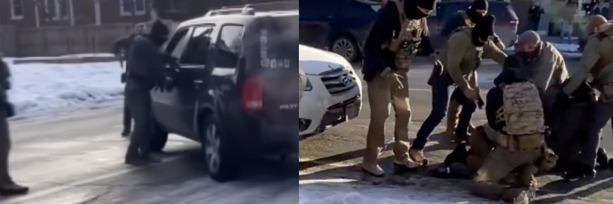
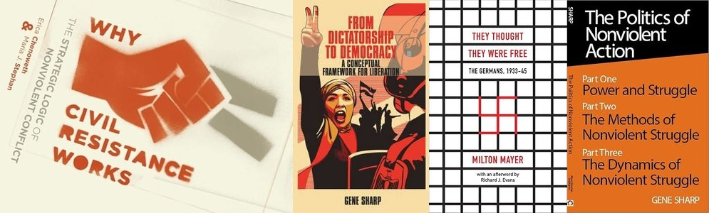
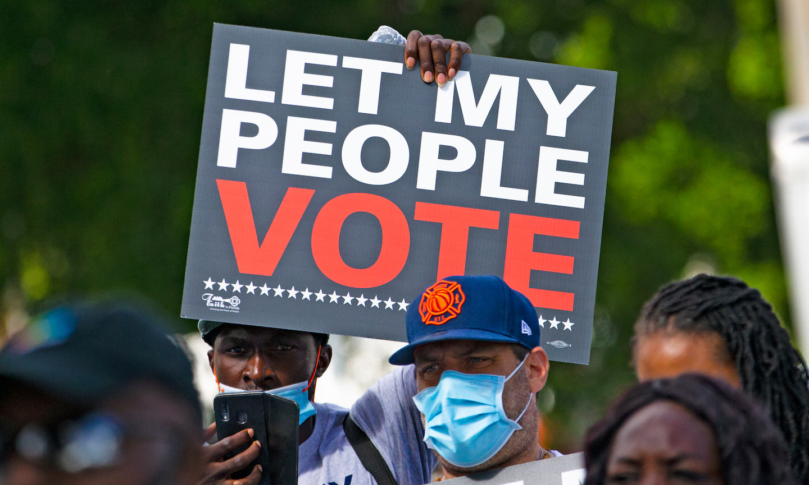
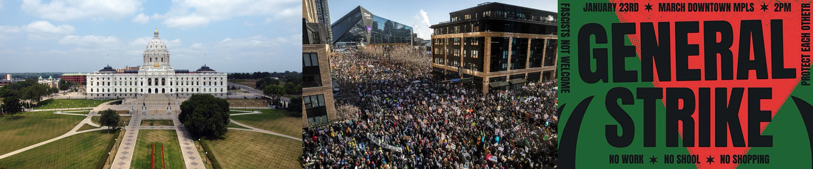
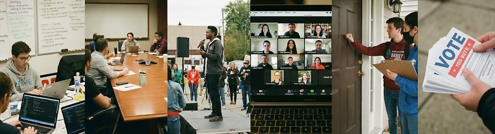

# Poets, Nurses, and Programmers

*What We Must Build in the Next Nine Months*

**January 2026**

---

#### I. Outrage Alone Is Not Effective

Renée Good was a thirty-seven-year-old American citizen, a poet and mother of three, driving in her Minneapolis neighborhood on January 7, 2026, when an ICE agent shot her dead. Less than three weeks later, on January 24, Alex Pretti, also thirty-seven, an ICU nurse at the VA hospital who had dedicated his life to caring for veterans, was pepper-sprayed, wrestled to the ground by six federal agents, and killed while holding his cell phone aloft. Video evidence contradicts every element of the Department of Homeland Security's account. These were American citizens, killed by American law enforcement officers, in an American city that had explicitly asked these officers to leave.

The outrage is real. Tens of thousands marched through Minneapolis in sub-zero temperatures the day before Pretti's death. Senators are demanding answers. Governor Walz has called the federal government's account ["nonsense... and lies"](https://www.npr.org/2026/01/25/nx-s1-5687361/minneapolis-shooting-latest-alex-pretti). The state has [filed lawsuits](https://www.minneapolismn.gov/news/2026/january/ag-lawsuit/) to halt the federal operation and to [preserve evidence](https://www.foxnews.com/politics/judge-blocks-trump-admin-destroying-altering-evidence-deadly-minneapolis-shooting) in the killings. But here is the truth we must confront: **outrage alone is not effective**. There is a gap, a vast and terrible gap, between what we feel and what we can achieve through normal political channels.

Consider the Senate Democrats who are voting against ICE funding this week. What leverage do they actually possess? To restrain ICE through appropriations, they must pass a budget. But passing a budget means providing the executive branch with funds to operate, including the very agencies they wish to restrain. And if they refuse to pass it? The government shuts down, but ICE continues anyway, drawing on $170 billion in pre-positioned funding that Republicans passed last year. As Senator Patty Murray [grimly noted](https://www.npr.org/2026/01/22/g-s1-106927/house-spending-homeland-immigration): "The suggestion that a shutdown in this moment might curb the lawlessness of this administration is not rooted in reality."

This is the paradox of democratic opposition to an autocratic executive: major levers of power have been anticipated and neutralized. The courts issue injunctions; they are ignored or circumvented. Congress passes restrictions; they are flouted or worked around. State officials assert jurisdiction; federal agents operate without coordination.

In a democracy, we expect to turn to the government to respond to our grievances. But the parts of government that respond to the people are being systematically dismantled. Military leadership has been purged of officers who might refuse illegal orders. Inspectors general across agencies have been fired. Whistleblower protections have been gutted. Government lawyers who raised legal objections have been removed. The president was impeached twice before and emerged unscathed. The Supreme Court has been remade in his image.

Many people look at this situation and see no path forward. They assume that if Congress cannot restrain the executive, if courts are ignored, if norms no longer bind, then nothing can be done. This assumption is understandable but wrong. The research on how authoritarian consolidation is prevented, and how it is reversed, points to a different set of levers entirely.

---

#### II. How Autocracies Are Stopped

Political scientist [Erica Chenoweth](https://www.ericachenoweth.com/), working with [Maria Stephan](https://en.wikipedia.org/wiki/Maria_Stephan), analyzed every major campaign for regime change from 1900 to 2006: 323 campaigns in total, both violent and nonviolent. Their findings, published in [*Why Civil Resistance Works*](https://www.jstor.org/stable/10.7312/chen15682), upend conventional assumptions about power.

Nonviolent campaigns succeeded 53% of the time. Violent campaigns succeeded 26% of the time. Nonviolent movements attracted four times as many participants on average. Countries that underwent nonviolent transitions were ten times more likely to establish lasting democracies. And most strikingly: no government in their dataset withstood a sustained challenge from 3.5% of its population.

Why does nonviolent resistance work? The mechanism is **not moral appeal**. It is not that oppressors are shamed into relenting. The mechanism is *defection*. Autocracies depend on the compliance of bureaucrats, judges, prosecutors, military officers, business leaders, and local officials. When enough of these people refuse to carry out orders, or when the cost of their compliance becomes too high, the machinery seizes.

This is the core insight of [Gene Sharp](https://en.wikipedia.org/wiki/Gene_Sharp), the political scientist who founded the [Albert Einstein Institution](https://www.aeinstein.org/) and spent six decades studying how dictatorships fall. Sharp's 1973 work *The Politics of Nonviolent Action* catalogued 198 methods of nonviolent resistance; his 1993 handbook [*From Dictatorship to Democracy*](https://www.aeinstein.org/free-resources/free-publications/english/) has been translated into more than 30 languages and used by resistance movements from Serbia to Egypt. The *New York Times* called him "the Clausewitz of nonviolent warfare." Sharp's research showed that power is not monolithic: every regime depends on the cooperation of thousands of people who can, under the right conditions, withdraw that cooperation.

Mass participation drives defection through several channels. It demonstrates that the regime lacks legitimacy. It creates cover for officials who want to resist but fear being isolated. It imposes economic costs that business elites cannot ignore. It makes every act of repression visible, raising the personal and professional costs of compliance. And it creates the political conditions for institutional actors to act.

Chenoweth [cautions](https://carrcenter.hks.harvard.edu/publications/questions-answers-and-some-cautionary-updates-regarding-35-rule) that 3.5% is a rule of thumb, not an iron law, and that since 2010, both nonviolent and armed resistance have become less effective as authoritarian regimes learn from history and coordinate with one another. But the fundamental insight holds: what stops autocracies is not appeals to conscience or reliance on normal institutions. What stops them is organized collective action that imposes costs too high to bear.

In America, 3.5% means roughly 11 million people in sustained engagement. This is not 11 million people attending a single march. It is 11 million people maintaining continuous, organized pressure over months. The Women's March in January 2017 brought out 4 to 5 million on a single day, and then most went home. We must do better. We must build infrastructure that sustains pressure long enough to trigger the defections that matter.

---

#### III. The 2026 Midterms: The Decisive Moment

The 2026 midterm elections are the decisive moment for American democracy. Trump has identified them as such. At a House Republican retreat on January 6, 2026, he [warned](https://www.nbcnews.com/politics/2026-election/trump-predicts-impeachment-if-republicans-lose-2026-midterms-rcna252604): "You got to win the midterms, because if we don't win the midterms... they'll find a reason to impeach me. I'll get impeached." He understands that a hostile Congress would have subpoena power, the ability to investigate, and the capacity to restrain executive action.

This is not a new concern. Since the Heritage Foundation began drafting [Project 2025](https://www.brennancenter.org/our-work/research-reports/project-2025-would-fuel-assault-election-officials), the conservative policy blueprint for Trump's second term, election interference has been central to the strategy. The Brennan Center [documented](https://www.brennancenter.org/our-work/analysis-opinion/whats-next-elections-under-project-2025-agenda) how Project 2025 proposed using the Justice Department to prosecute election officials who make decisions the administration dislikes, gutting CISA's election security support, and weaponizing federal power against those who resist election subversion. The administration is now executing that playbook.

The [Brennan Center for Justice](https://www.brennancenter.org/our-work/research-reports/trump-administrations-campaign-undermine-next-election) has documented what they call "an unprecedented campaign to undermine American elections." The actions already underway include: **[gutting election security infrastructure](https://www.democracydocket.com/news-alerts/cisa-puts-election-staff-on-administrative-leave/)**, with much of CISA's election security staff laid off or put on administrative leave and funding cut to information-sharing partnerships; **[installing election deniers in key positions](https://www.propublica.org/article/heather-honey-dhs-election-security)**, including a deputy assistant secretary for elections integrity who worked alongside Cleta Mitchell to spread conspiracy theories; **[creating federal task forces targeting voters and officials](https://abcnews.go.com/US/bondi-new-ag-launches-weaponization-working-group-review/story?id=118501463)**, including the DOJ's Weaponization Working Group; **[demanding voter data from states](https://www.npr.org/2025/12/12/nx-s1-5642610/doj-voter-data-lawsuits-colorado-hawaii-massachusetts-nevada)**, with the DOJ suing 22 states and the District of Columbia after they refused to turn over voter information; **[driving out experienced election officials](https://www.brennancenter.org/our-work/analysis-opinion/poll-election-officials-shows-high-turnover-amid-safety-threats-and)**, with 59% now reporting fear of political interference in their ability to do their jobs; **[mid-decade redistricting](https://www.npr.org/2025/12/08/nx-s1-5634585/redistricting-2026midterm-election-trump-congress)**, with partisan gerrymandering pushed through in Texas, North Carolina, and Missouri outside the normal post-census cycle; and **[targeting mail-in voting](https://www.votebeat.org/2026/01/07/us-postal-service-usps-postmark-rule-impact-mail-voters-absentee-ballots/)**, with executive orders and new postal guidance raising concerns about whether mail ballots will be counted.

Election officials are gaming out what comes next: **[federal troops or agents at polling places](https://www.mediamatters.org/steve-bannon/steve-bannon-says-ice-agents-will-be-near-polling-places-if-you-dont-have-id-if-youre)**, which Steve Bannon has openly advocated for and the administration has not ruled out; **[emergency declarations](https://www.democracydocket.com/news-alerts/cleta-mitchell-thinks-trump-will-use-emergency-powers-to-take-control-of-elections/)**, with Cleta Mitchell indicating Trump could declare a national emergency based on "election integrity" and exercise emergency powers over federal elections; **[seizing voting machines](https://www.denverpost.com/2025/07/16/colorado-clerks-voting-machine-access-elections-donald-trump/)**, with DHS intermediaries already seeking access to voting equipment in Colorado and Missouri; and **[post-election certification interference](https://www.citizensforethics.org/reports-investigations/crew-investigations/election-certification-under-threat/)**, using federal pressure on state officials to refuse certification of results.

And we should be clear-eyed about what comes after certification. The administration is consolidating police and military control over Washington, D.C. Given the militarization of ICE, the willingness to shoot American citizens in the streets, and the pattern of ignoring court orders, we should take it as a given that the administration will physically interfere with the seating of the 2027 Congress if the election results threaten its power. This could mean flying in losing candidates to claim seats, preventing winners from entering the city or the Capitol, or jailing elected officials on spurious charges of election fraud. These steps would be mild compared to what we have already witnessed in Minneapolis. The confrontation does not end on Election Day. It extends through certification, through the lame duck period, and through the moment when a new Congress attempts to take the oath of office.

The dissolution of midterm results is the Rubicon we must not cross. If the administration successfully interferes with the election and faces no consequences, or if it loses but refuses to accept the results, the constitutional order is over. We will not vote our way out of what follows.

Protection of the midterms must be our highest priority. Everything else, every other issue, is secondary to preserving the mechanism by which power can be transferred and accountability restored.

---

#### IV. Three Points of Leverage

Given this analysis, three sources of leverage emerge: not as protest tactics, but as strategic chokepoints where organized resistance can impose costs high enough to change calculations.

**1. State Governmental Capacity**

States retain constitutional authority over elections. Governors command state law enforcement and National Guards. State attorneys general can litigate. Secretaries of state certify results. If state officials refuse to cooperate with federal interference in elections, and if that refusal is coordinated across states and backed by the credible threat of using state power to resist, the administration faces a choice: accept electoral defeat, or use military force against American states.

This is not hypothetical. Governor Walz is currently in direct confrontation with the federal government over Minneapolis. The question is whether this confrontation can be sustained and expanded. The infrastructure needed includes: governors and secretaries of state who commit publicly to resisting federal interference; coordination mechanisms between states so resistance is not isolated; legal defense funds for officials who may face federal prosecution; litigation strategies prepared in advance; and state law enforcement prepared to enforce state authority.

*What you can do:* Support secretaries of state and governors who will resist. This means both electoral support and public pressure to commit now. Build relationships between state officials across states. Contribute to legal defense funds. Pressure state attorneys general to prepare litigation. Know who your state election officials are and whether they will hold.

**2. Mass Mobilization Capacity**

Mass mobilization does not change autocratic calculations through moral witness. It changes them by imposing political costs on every official who cooperates with authoritarian consolidation. When millions of people are in the streets, every bureaucrat who follows an illegal order, every legislator who enables interference, every judge who looks away, does so in front of cameras, with their constituents watching, with their future career on the line. Mass mobilization creates the political cover for institutional actors to defect, and it raises the cost for those who don't.

The infrastructure needed is not email lists or social media followers. It is organizations with actual capacity to move people: to get them to specific places at specific times, to sustain their presence over days and weeks, to maintain nonviolent discipline under provocation, to keep them safe.

The Minneapolis protests demonstrate both the potential and the seeds of something larger. The ICE Watch networks that have emerged, with their decentralized structure, rapid communication systems, and capacity to move people to specific locations at short notice, are exactly the kind of infrastructure that election protection will require. When federal agents attempt to intimidate voters, the same networks could get people safely to the polls, document intimidation tactics, and record voter misinformation campaigns. The organizing muscle being built now is the organizing muscle that will matter in November.

*What you can do:* Join organizations with real mobilization infrastructure. Indivisible has 2,500 local groups in 99% of congressional districts. Participate in current ICE Watch and protest activities to build relationships and muscle memory. Build local networks that can activate quickly. Develop communication systems that don't depend on platforms the administration can control. Train in nonviolent discipline and de-escalation. Understand that this organizing is not separate from election protection; it is election protection.

**3. Economic Leverage**

Economic leverage is the least understood and potentially most powerful tool. If interference with elections triggers coordinated work stoppages across sectors, business closures at scale, consumer boycotts of companies that cooperate, capital flight and market disruption, and international economic consequences, then the administration faces a calculation: is holding power worth economic collapse?

The "economic blackout" that preceded the January 23 march in Minneapolis, with businesses closing and workers staying home, was a demonstration of capacity. The same infrastructure that can affect a state economy for a day can affect the national economy for a week. The labor-business-faith coalition being built in Minnesota is nationally significant.

But scaling this is the hardest problem. Individual businesses that resist face retaliation. When one hotel tried to refuse ICE agents, corporate headquarters reversed the decision within hours. Hilton's stock dropped 2.5% after DHS posted about the alleged ban. The same prisoner's dilemma applies to every business: act alone, and you absorb all the cost while competitors take the business.

The solution requires building coalition infrastructure that can secure public, binding commitments from multiple actors simultaneously. If all the major hotel chains committed together, none would be isolated. If unions across sectors committed to strike together in defense of elections, the economic cost of interference becomes unacceptable. If business associations, not just individual businesses, made public commitments, members would have cover.

This infrastructure does not exist at the scale needed. Building it is the work of the next nine months.

*What you can do:* If you're in a union, push for explicit commitments to strike in defense of elections. If you're a business owner, find others willing to make public commitments together. Work through business associations, chambers of commerce, and industry groups. Build relationships across the labor-business divide around shared commitment to democracy. The commitments need to be made now, publicly, so that everyone knows what will happen.

If you're in academia, the stakes are equally high. [Universities are being targeted](https://www.brookings.edu/articles/targeting-higher-education-is-an-essential-tool-in-the-autocratic-playbook/) precisely because they are bulwarks of democracy: they generate independent research, train critical thinkers, and provide institutional cover for dissent. The [AAUP](https://www.aaup.org/academe/issues/spring-2025/higher-education-and-defense-democracy) has called defending democracy "the defining challenge of our time" for higher education. Faculty unions at [University of California](https://higheredlaborunited.org/2025/07/22/the-university-of-california-system-labor-actions-loom-in-2025-2026/) and other institutions are building strike capacity that could be directed toward election defense. If you're a faculty member, work through your union or faculty senate to build explicit commitments. If your president [won't speak out](https://verdict.justia.com/2025/03/12/if-college-presidents-wont-speak-out-in-defense-of-democracy-and-the-rule-of-law-their-faculties-should), faculty can speak collectively. If you're an administrator, consider what [Harvard did](https://www.chronicle.com/article/how-a-university-fights-an-authoritarian-regime): refuse to capitulate, defend institutional autonomy, and recognize that early cooperation with authoritarian demands does not buy safety—it only delays and worsens the eventual confrontation. Build alliances beyond campus: with local businesses, unions, faith communities, and families who understand that [when a university is attacked, everyone's freedom is attacked](https://www.amacad.org/publication/daedalus/geopolitics-academic-freedom-universities-democracy-authoritarian-challenge). For more on what universities can do, see: [The Convening Role of Universities](academics-convening.md) and [The Winter 2027 Commitment](winter-2027.md).

---

#### V. Building the Infrastructure

The three leverage points require infrastructure to activate. Organizations exist that are building this infrastructure. Your task is to find them, join them, strengthen them.

**For State Capacity**

[Protect Democracy](https://protectdemocracy.org) combines litigation, policy advocacy, and technology to defend democratic institutions. Their legal teams are actively challenging administration overreach. [Democracy Forward](https://democracyforward.org) meets the administration in court. [The Brennan Center for Justice](https://www.brennancenter.org) provides research and legal support for election officials. State-level organizations vary; find yours.

**For Mass Mobilization**

[Indivisible](https://indivisible.org) has the largest distributed organizing infrastructure in the country: 2,500 local groups, 99% congressional district coverage, weekly coordination calls, rapid response capacity. Their [Guide](https://indivisible.org/resource/guide) provides tactical guidance for operating under authoritarian conditions. [Common Cause](https://commoncause.org) co-leads the Election Protection network. The **Election Protection Hotline** (866-OUR-VOTE) deploys thousands of trained volunteers.

The ICE Watch networks emerging in Minneapolis and other cities represent something new: decentralized, neighborhood-based rapid response capacity. [States at the Core](https://statesatthecore.us) has been training thousands in community defense tactics. These networks need to be built in every city, and their organizers need to understand that the same infrastructure will be needed for election protection.

**For Economic Leverage**

This is the least developed infrastructure and the most needed. Union locals are the foundation. If you're a member, the work is internal organizing for explicit election-defense commitments. Business coalitions are emerging but informal. Faith communities have moral authority and economic reach. The Minnesota model, with its labor-business-faith coalition, needs to be replicated nationally.

The hardest work is stitching these together: creating organizations where businesses, unions, and faith communities can make binding commitments to collective action. No single business can resist alone. But if the commitment is collective, public, and credible, it changes the calculation.

**For Technical Infrastructure**

All three leverage points require technical capacity: secure communications, rapid coordination, voter protection tools, data analysis, disinformation monitoring. If you work in technology, your skills are desperately needed. [Tech for Campaigns](https://techforcampaigns.org) matches skilled volunteers with campaigns. [Ragtag](https://ragtag.org) connects technologists with progressive organizations. [Higher Ground Labs](https://highergroundlabs.com) coordinates investment in progressive tech infrastructure.

---

#### VI. Nine Months

Here is what you can do in the next nine months:

**This week:** Identify which leverage point matches your position. If you have connections to state government, start there. If you're in a union or own a business, start building economic commitments. If neither, join a local Indivisible chapter or equivalent, or find your local ICE Watch network. If you have technical skills, sign up at techforcampaigns.org or ragtag.org. Call your senators about ICE funding, not because it will pass, but because it builds the habit and the record.

**This month:** Attend a local meeting. Make a recurring donation to organizations building infrastructure. Identify three friends who are not yet engaged and bring them in. If you're in a union, raise the question of election-defense commitments. If you're a business owner, find others willing to make public commitments.

**By spring:** Have a regular role in an organization. Know who runs your local and state election apparatus. Have a communication plan that doesn't depend on platforms the administration controls. If you're building economic leverage, have explicit commitments from at least a dozen allies.

**By summer:** Be trained in election protection. Be part of poll worker recruitment in your area. Have relationships with people in each of the three leverage areas. Know the rapid response plan if results are contested.

**By fall:** Have a specific role in the election. Know what you will do if interference occurs. Be prepared to sustain engagement through January. Have already made the commitments, to show up, to strike, to close, to resist, that create the costs that matter.

The honest truth is that success is not guaranteed. The variables include: Will state officials actually hold, or will they capitulate under federal pressure? Will courts issue injunctions and will anyone enforce them? Will mass mobilization be sustained over weeks, or will it dissipate? Will strikes impose enough economic cost to matter? Will any Republican officials defect, or will party discipline hold? Will the military refuse illegal orders, or will it comply?

None of these can be known in advance. But each of them is influenced by the infrastructure that exists. State officials are more likely to hold if they see others holding. Mobilization is more likely to be sustained if organizations exist to sustain it. Economic leverage is more likely to matter if commitments are made in advance, publicly, so that everyone knows what will happen.

The majority of Americans oppose what is happening. The question is whether that majority can be organized into collective action that creates political facts. That's not guaranteed. But it's possible. And the work of making it possible is the work that matters now.

We are not alone. We have power, if we organize it. The question is whether we will build the infrastructure in time.

---

#### Resources

**Research**

- Chenoweth, E. & Stephan, M. (2011). [*Why Civil Resistance Works: The Strategic Logic of Nonviolent Conflict*](https://www.jstor.org/stable/10.7312/chen15682). Columbia University Press.
- Chenoweth, E. (2020). ["Questions, Answers, and Some Cautionary Updates Regarding the 3.5% Rule."](https://carrcenter.hks.harvard.edu/publications/questions-answers-and-some-cautionary-updates-regarding-35-rule) Carr Center for Human Rights Policy, Harvard Kennedy School.
- Sharp, G. (1973). *The Politics of Nonviolent Action*. Porter Sargent Publishers.
- Sharp, G. (1993). [*From Dictatorship to Democracy*](https://www.aeinstein.org/free-resources/free-publications/english/). Albert Einstein Institution. (Free PDF available)
- Brennan Center for Justice. (2026). ["The Trump Administration's Campaign to Undermine the Next Election."](https://www.brennancenter.org/our-work/research-reports/trump-administrations-campaign-undermine-next-election)
- Brennan Center for Justice. (2024). ["Project 2025 Would Fuel the Assault on Election Officials."](https://www.brennancenter.org/our-work/research-reports/project-2025-would-fuel-assault-election-officials)

**Organizations**

- [Indivisible](https://indivisible.org)
- [Protect Democracy](https://protectdemocracy.org)
- [Democracy Forward](https://democracyforward.org)
- [Brennan Center for Justice](https://www.brennancenter.org)
- [Common Cause Election Protection](https://www.commoncause.org/our-work/voting-and-elections/election-protection/)
- [Tech for Campaigns](https://techforcampaigns.org)
- [Ragtag](https://ragtag.org)
- [Higher Ground Labs](https://highergroundlabs.com)
- **Election Protection Hotline:** 866-OUR-VOTE (866-687-8683)

---

#### Contribute to This Document

This is a living document. If you can improve it — with better suggestions for concrete action, links to high-quality resources, or ideas for building organizational infrastructure — please contribute. [Pull requests welcome on GitHub](https://github.com/davidbau/poetsandnurses).
